# Motion Planning Scenes

Motion planning consists of finding a path from a state A to a goal state B while avoiding
obstacles.

There is a wide range of motion planning libraries that focus mostly on motion planning problems
formulated in the configuration space [OMPL](https://ompl.kavrakilab.org/). This approach
is usually based on inverse kinematics to transform real-world goals into suitable
configurations. 

This repository formulates a generic motion planning scene, including both moving and
static obstacles and a generic formulation of goals.

## Obstacles

Obstacles can be roughly split into two categories, moving and static.

## Goals

Goals for motion planning should not depend on the robot's structure, neither should they
involve orientation that are generally hard to obtain and hardly human understandable.

## Structure (Beta)

